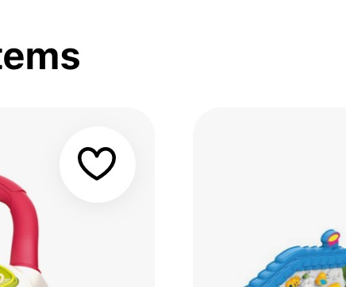
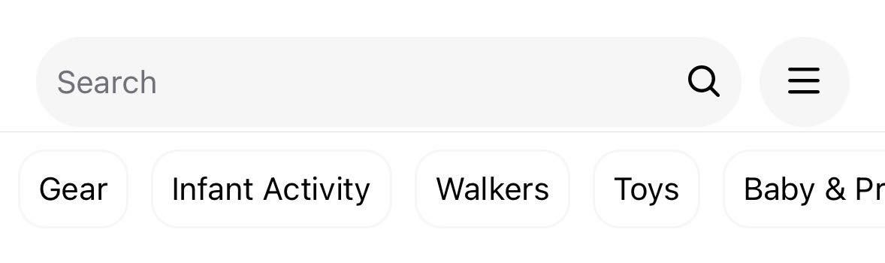
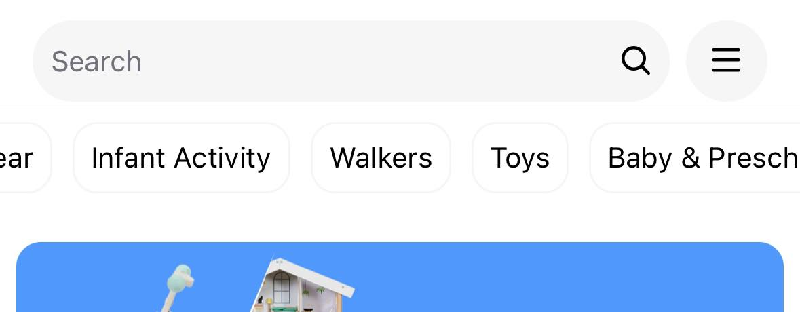
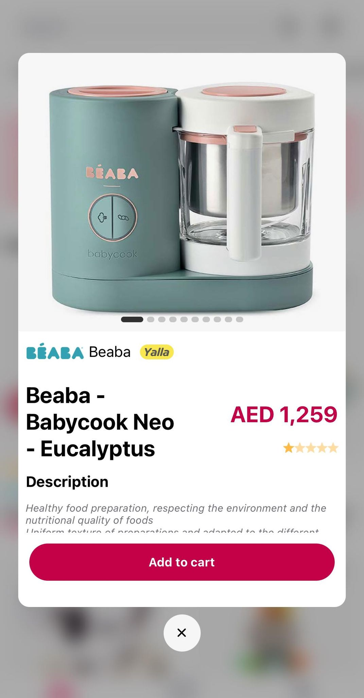

# MumzWorld App Documentation

## Overview

This document outlines the key changes implemented in the eCommerce app. The focus was on enhancing the visual appeal and usability while maintaining a familiar layout.

## Key UI Enhancements

> These changes do not claim to provide a better solution than the current one, but merely reflect personal preferences due to the lack of data about the business side of the project.

### Layout

- **Consistency**: The original layout was preserved to ensure a smooth transition for users familiar with the previous design.
- **Simplification**: The product card now displays fewer items, reducing visual clutter and focusing on essential product information.

### Visual Design

- **Contrast Enhancement**: A dark-colored overlay was added on top of white background product images to create a subtle contrast with the white background of the screen. This not only improves readability but also adds a modern touch to the design, which can also provide the possibilty to apply a colorful tint that would match a current theme of the products list category in a dynamique and data efficiant way.

- **Rounded Edges**: All elements, including buttons and product cards, now feature rounded edges. This design choice softens the visual appearance, making the app more aesthetically pleasing and user-friendly.

- **A new filter form**: The filter Form was reimplimented to be a bit more interactive and easy to use with an updated version of the price range picker
- > Text search input is debounced

- **Product details page**: I couldn't come up with something better than the original app, so i just implimented a simpler version.

- **Small details**
  I tried to make sure to keep a visual consistancy to when to it comes to sizes, margins and borders, and make sure horizontal lists won't be affected by screen pading
  
  

### User Experience

- **Long press for more**: By long pressing on a product card, a modal pops up to show more details about the product, making more information accessible while staying on the same screen.

  

- **Focus on Key Information**: By reducing the number of items on the product card, users can quickly grasp essential product details without being overwhelmed.

- **Native navigation**: made use of the reactNavigation native stack navigation to provide a native feel to navigation gestures (swipe to go back)

## Technical choices

### API consumption

Assuming that the provided end points are for a restfull API, @tanstack/react-query seem to be a great solution when it comes to data fetching and caching, the hooks are wrapped in a home made hook that can (supercharge it or provide an alternative interface) but essentially to keep the code easily replaceable

Apollo client would be my choice for a GQL API

### Large data set handeling

FlashList component by Shopify (even with it's caveats) is still a conciderable solution that can in fact handle the randering of a large set of components in an efficiant way

> No React hook such useMemo was needed to have any improvement on the performance of the app

### Navigation

ReactNavigation is a battle tested library that does it's job perfectly (it's even the building block of expo's file based router)

### Unit testing

Jest and @testing-library/react-native are good enough libraries for the simple scenarios that have been treated on the test suits (one test for a functions file and one test for a component)

### Coding style

**Naming convention**:

- Pascal Case for jsx files
- camel Case for ts files
- kebab-case for folders
- SCREAMING_SNAKE_CASE for constants

**JSX and reusability**

- I'm comfortable using inline styling or or Stylesheets or styled components, it all depends on the team
- I try to find a balance between reusability and maintainability when it comes to writing my components but it all gets decided by the overall view of the team

### API changes

**Mandatory changes**:

- add pagination
- add qury params

**Nice to have**

- blurhash for images
- reviews field in the products list response
- list of images of the product to display a galery without going to the details screen

**Maybe ?**

- send a boolean for is_yalla flag instead of an array of locations (the backend knows already the current location of the user)
- send a single payload of the product details that containes an array of objects that contain internationalized labels instead of multiple payloads one for each language

## Current issues

### RTL

unfortuanitly, a new "issue" has been introduced to expo starting from sdk50 where the expo go app relies on the phone's language prefrences to determin the language every time it lauches which overrides the previous setting of I18nManager.isRTL resulting in an infinit loop when reloading the app to ttrigger layout direction change using Updates.reloadAsync() :

It's still possible to test the RTL layout by setting the phone language to Arabic:
[the community still want to reopen the issue](https://github.com/expo/expo/issues/26532)

> a developement build can be a solution but currently i'm using a windows

> please uncomment the line 26 in StoreProvider.tsx

### FlashList and RTL

Flashlist unfortuanitly has an issue with RTL layout when rendering the list as multiple columns. an issue for the sake of time limit i couldn't come up with a proper workarround for it yet : [link to the issue that it's still open](https://github.com/Shopify/flash-list/issues/1207)
